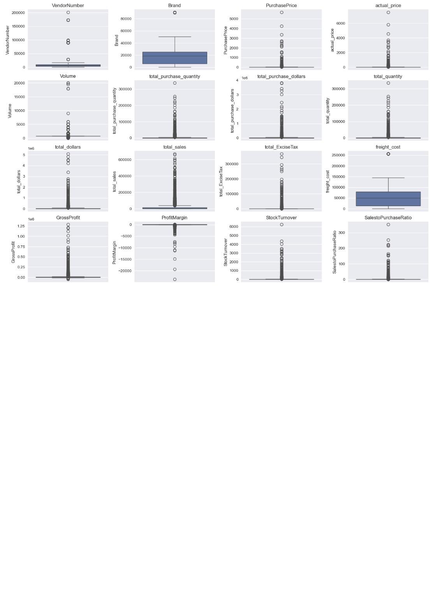
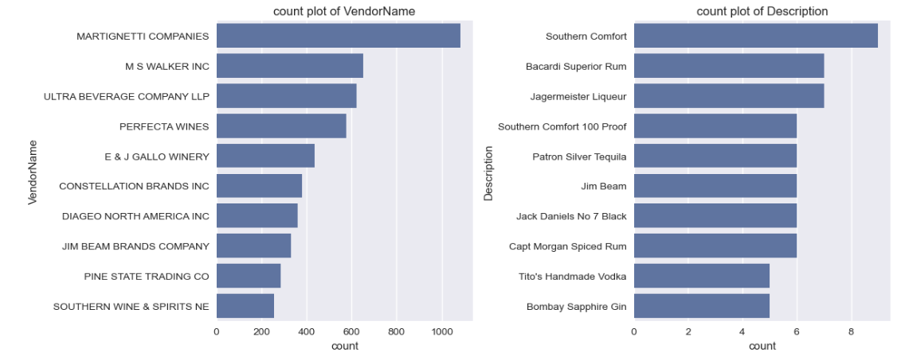

# SIDDHARTH_SAWAI_PORTFOLIO

# [Project 1: Vendor Performance Analysis ](http://www.example.com)  
This is a project for vendor performance analysis, in which I have explore various techniques 
such as EDA,Visualization,KPI,confidance inteval,hypothesis testing,top performance,bulk purchase analysis over unit price.

* Data was taken from the kaggle dataset ()
* The model uses both; content-based filtering techniques and collaborative filtering techniques. 
* Algorithms Used : K-Nearest Neightbours, TF-IDFS, Singular Value Decomposition Model (SVD), Alternatining least Square (ALS) 
* Optimised the SVD & ALS model. 
* The Project Write-up is published on [SSRN](https://papers.ssrn.com/sol3/papers.cfm?abstract_id=3791837)

## Overview Of The Singular Value Decomposition Architecture  
 
## Popular Movie Genres  

