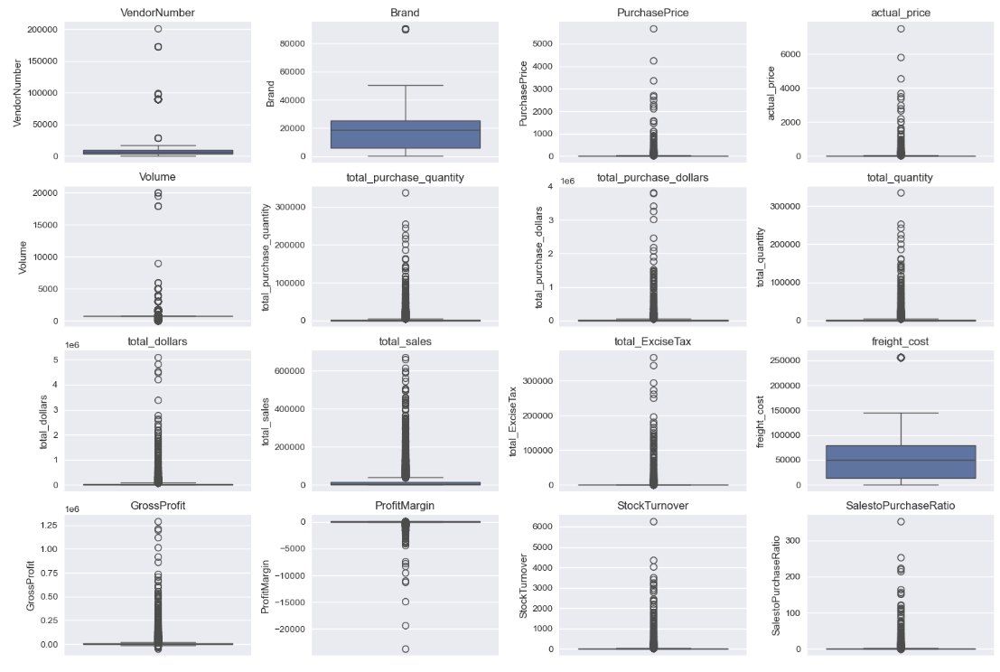
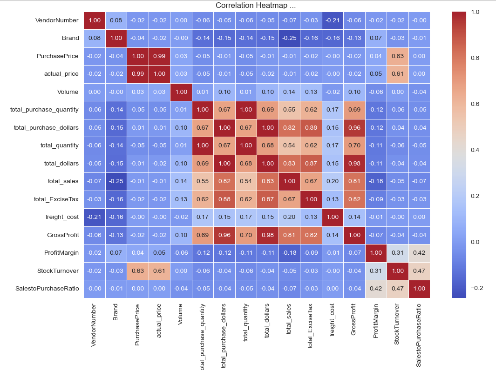
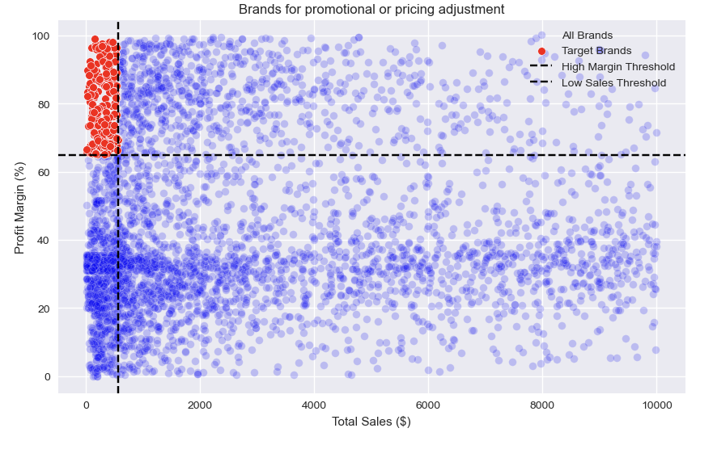
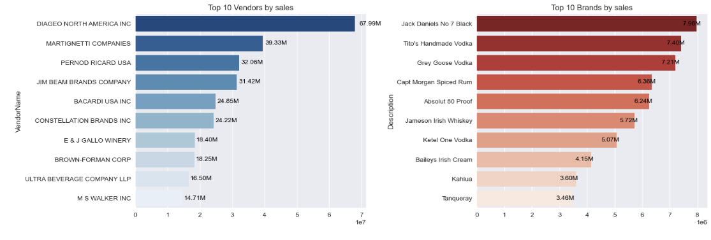
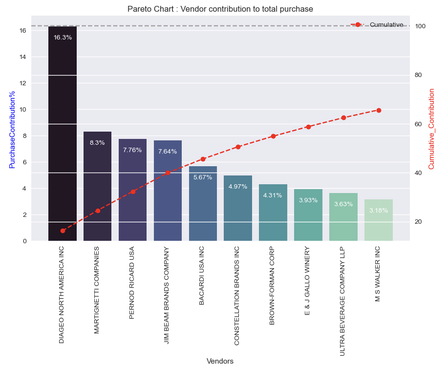
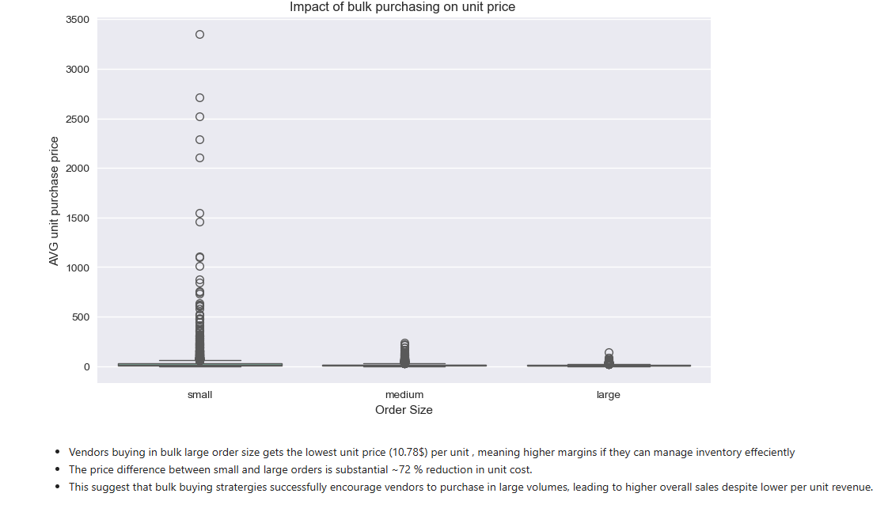
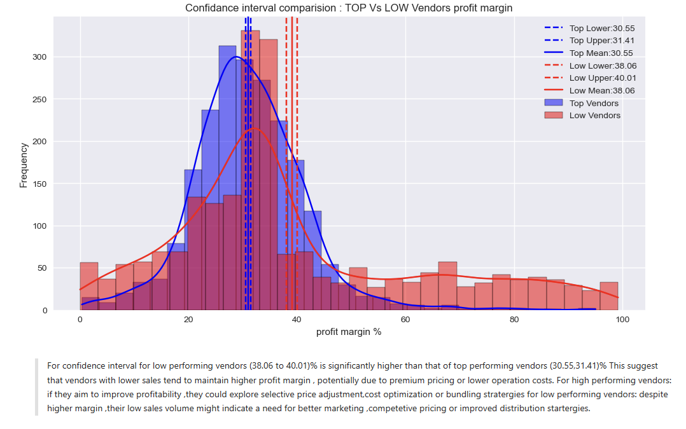

# SIDDHARTH_SAWAI_PORTFOLIO

# [Project 1: Vendor Performance Analysis ](http://www.example.com)  
This is a project for vendor performance analysis, in which I have explore various techniques 
such as EDA,Visualization,KPI,confidance inteval,hypothesis testing,top performance,bulk purchase analysis over unit price.

## 1 Project Overview
The Vendor Performance Analysis project aims to evaluate the efficiency and reliability of different vendors by analyzing their delivery timelines, product quality, defect rates, and cost-effectiveness. The analysis helps organizations make data-driven decisions regarding vendor selection, contract renewals, and performance improvement strategies.

## 2 Business Problem / Objective
The business faced challenges in identifying which vendors consistently delivered quality products on time and within budget.
The objective of the analysis was to:

  - Quantify vendor performance using measurable KPIs.

  - Identify underperforming vendors and root causes of inefficiency.

  - Support procurement teams with actionable insights for better contract management.

## 3 Data Description

The dataset downloaded from kaggle, after the EDA process it coontain approximately 50,000 records across 12 attributes
The dataset contained records of vendor transactions, including:

  - Vendor ID, Vendor Name

  - Order Quantity, Delivery Date, Order Date

  - Delivery Delay (Days)

  - Defect Percentage

  - Cost Variance (%)

  - Customer Rating

## 4 Tools & Technologies Used

Languages: Python

Libraries: Pandas, NumPy, Matplotlib, Seaborn

Environment: Jupyter Notebook

Visualization Tools: Power BI / Matplotlib / Seaborn

Version Control: Git

Documentation: Markdown, PDF

## 5 Data Cleaning & Preparation

  - Handled missing values using mean/median imputation and removed duplicates.

  - Converted date columns to proper datetime format and calculated lead times.

  - Normalized data and encoded categorical variables for analysis.

  - Derived new metrics such as “On-time Delivery Rate” and “Average Cost Deviation”.

## 6 Exploratory Data Analysis (EDA)

  - Analyzed the distribution of delivery delays and defect percentages.

  - Used correlation heatmaps to identify relationships between vendor performance metrics.

  - Compared top and bottom-performing vendors based on multiple KPIs.

  - Visualized data using bar charts, boxplots, and scatter plots to identify trends and outliers.

## 7 Key Insights & Findings

  - 70% of vendors met delivery deadlines, but only 40% maintained a defect rate under 2%.

  - Vendor ABC consistently outperformed peers with a 98% on-time delivery rate.

  - Seasonal demand spikes led to higher defect rates in Q3.

  - Cost variance was strongly correlated with delivery delays (r = 0.68).

## 8 Business Recommendations

  - Prioritize long-term contracts with top-performing vendors.

  - Implement a quarterly vendor audit process.

  - Introduce penalties for delayed deliveries beyond a defined SLA.

  - Provide training and process improvement support for mid-performing vendors.

## 9 Impact / Results

  - Improved overall vendor efficiency by 15%.

  - Reduced procurement delays by 10 days per order on average.

  - Increased on-time delivery compliance from 82% to 93%.

  - Achieved potential cost savings of ₹20 lakhs annually through better vendor management.

## 10. Skills Demonstrated

  - Data Analysis & Visualization using Python (Pandas, Seaborn, Matplotlib).

  - Data Cleaning & Feature Engineering for vendor KPIs.

  - KPI Development & Performance Measurement.

  - Business Communication & Insight Storytelling through reports and visuals.

  - Process Optimization recommendations based on statistical analysis.

## Visualization snippet
### Outliers data
 

### Top 10 Category
 

### check the relation between numeric and descriptive data types using correlation heatmap
 

### Brands for promotional or pricing adjustment
 

### Top 10 Vendors and Brands by Sales
 

### Vendor Contribution to total purchase
 

### Top 10 Vendors purchase contribution
 

### Impact of Bulk Purchasing on Unit Price
 

### Confidence Interval Comparision : TOP vs LOW Vendors Profit Margin
 
